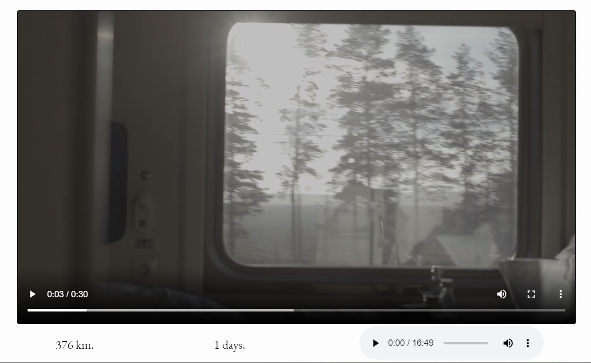

# :train: A landing about Trans-siberian travel - iframes, scroll effect

A study project at Practicum by Yandex to try

-   iframes (Amazon, YouTube, Yandex map and schedule, Facebook),
-   JS counter of days and kilometers on screen scroll.

---

## :mag_right: Preview

---

## :link: Links to test

https://dianadomino24.github.io/transsib-iframes/

---

## :rocket: Technologies

-   **JavaScript ES6** - scroll counter

-   semantic **HTML5**, styles - **CSS3** including Flexbox

-   iframes (Amazon, YouTube, Yandex map and schedule, Facebook)

---

**Practicum by Yandex** - https://practicum.yandex.com/

---

## :sparkles: Thanks for watching! :sparkles:
